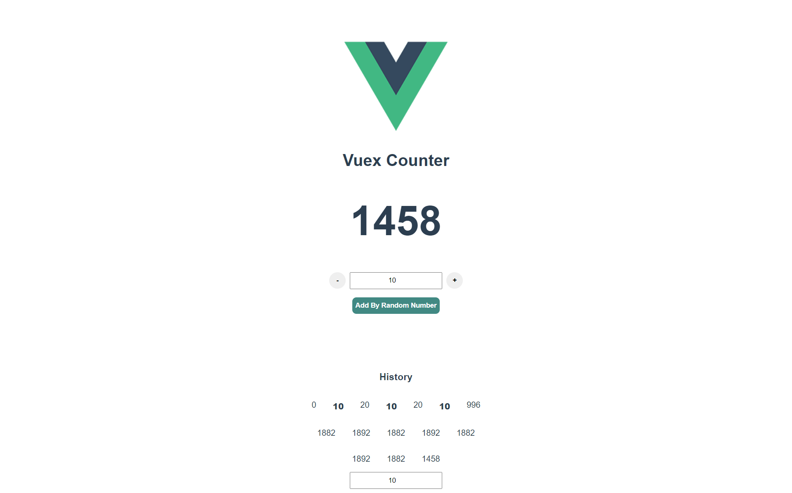

# vue-with-vuex

## Project setup
```
npm install
```

### Compiles and hot-reloads for development
```
npm run serve
```

### Compiles and minifies for production
```
npm run build
```

### Lints and fixes files
```
npm run lint
```

### Reference From
See [Configuration Reference](https://www.youtube.com/watch?v=y7DQhNs9Azw&ab_channel=LaithHarb).
